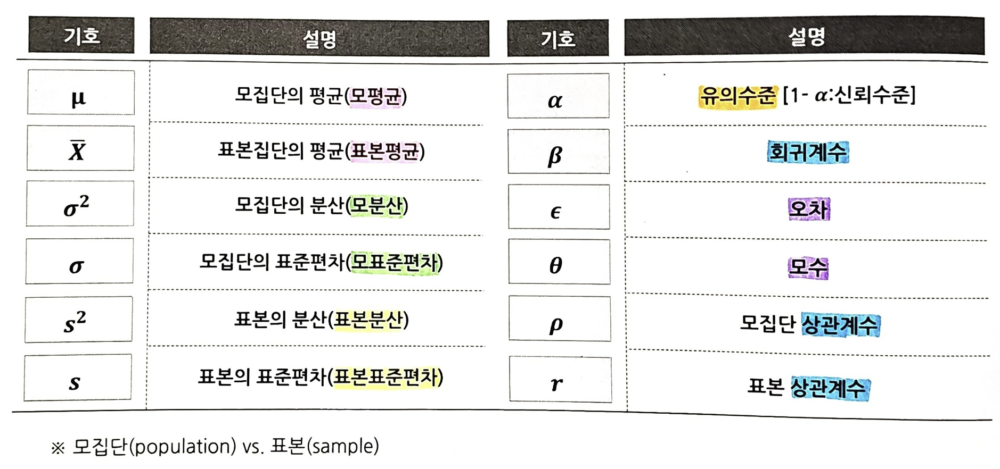

# 통계란?
### 통계 : 수량적인 비교를 기초로 많은 사실을 다양한 방법으로 관찰, 처리한다.
### 통계학 : 인문, 사회 및 인간 생활의 온갖 현상을 연구하기 위하여, 불확실성이 내포된 데이터의 선택, 관찰, 분석 및 추정을 통하여 의사결정에 필요한 정보의 획득과 처리 방법을 연구하는 학문

### 통계의 구분
```
기술(Descriptive) 통계 vs 추론(Inferential) 통계

- 기술통계
: 수집된 데이터로부터 평균, 분산 등의 요약 통계량이나 그래프를 이용하여 체계적으로 정리/요약하여 전반적 특성을 파악하는 통계기술

- 추론 통계
: 표본에 포함된 정보로부터 모집단의 특성을 파악 및 타당성을 검토하여 모수를 추론하거나 미래를 예측하는 통계기술
```

# 기술통계
#### 데이터의 속성을 특정한 통계량을 사용해 정리, 요약, 설명하는 방법
#### 기술통계는 매우 간단한 통계량으로 엄청난 양의 데이터가 갖는 속성을 합리적인 방법으로 간명하게 요약해 줌으로써 독자가 데이터의 속성을 쉽게 이해할 수 있도록 도와준다.
```
1. 중심척도(Central Tendency)
- 산술평균(Arithmetic Mean)
- 중위값(Median)
- 최빈치(Mode)

2. 산포척도(Degree of Dispersion)
- 분산(Variance)
- 표준편차(Standard Deviaition)
- 범위(Range)

3. 분포 모양
- 빈도(Frequency)
- 상대도수, 누적도수
- 비대칭도(왜도, Skewness)
- 첨도(Kurtosis)
```

## 1. 중심 척도
### 중심경향성
- 중심경향성은 용어 그대로 중심적인 경향을 나타내는 주요한 기술통계
- 중심경향 통계량은 데이터의 퍼져 있음, 즉 산포 정도까지는 설명하지 못함
### 산술평균(Mean)
  └ 관측치의 총합을 관측치의 갯수인 n으로 나눈 것<br>
  └ 가장 보편적이고 대표적인 대표값<br>
  └ 특이치(Outlier)에 민감하여 영향을 받음<br>
  └ 수치 척도에 의미가 있음, 순서척도인 경우에도 사용함<br>
### 중앙값(Median)<br>
  └ 전체 주어진 관측치를 크기 순으로 나열했을 때 중앙에 위치하는 관측치<br>
  └ 실제 데이터에 의존하지 않으므로 특이치(Outlier)에 영향을 덜 받는다(Robustness)<br>
### 최빈값(Mode)<br>
  └ 전체 주어진 관측치들 중에서 가장 빈도가 높은 값으로 정의함<br>
  └ 명목척도로 측정된 자료에 대한 대표값으로 사용됨

## 2. 산포 척도
-  산포 : 데이터의 퍼져 있는 정도를 설명하는 기술통계
### 범위(Range; R)<br>
  └ 최대값과 최소값의 차이<br>
### 분산(Variance; s^2)<br>
  └ 평균에서 각 데이터까지의 거리를 제곱한 수치의 평균<br>
### 표준편차(Standard Deviaition; S)<br>
  └ 편차들의 평균<br>
  └ 분산에 제곱근을 하여 구한 값<br>
  └ 특이치(Outlier)에 민감하여 영향을 받음<br>
### 사분위수 범위(Interquartile Range; IQR)<br>
  └ 사분위범위 = 3사분위수 - 1사분위수<br>
  └ 범위에 비하여 Outlier의 영향을 덜 받음(Robustness 성질을 지님)

## 3. 분포 모양
- 데이터가 퍼져있는 형태를 나타낸 것
### 도수(Frequency) 분포<br>
  └ 도수, 상대도수, 누적도수
### 비대칭도(왜도, Skewness)<br>
  └ 분포가 어느 한쪽으로 치우친 정도를 나타냄
### 첨도(Kurtosis)<br>
  └ 분포 모양이 얼마나 뾰족한가 완만한가를 나타내는 정도

## 자주 보는 통계 기호들
