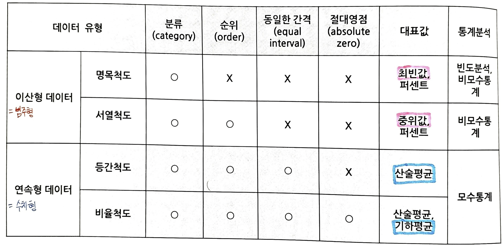

# 데이터의 유형
## 연속형(Continuous) 데이터(수치형 데이터)
- 나누어질 수 있고, 연속적으로 측정될 수 있는 것
- 예 : 제품 중량(㎏), 온도(℃), 강도(㎏/㎠) 등 계량형 데이터
### 등간척도(Interval Scale)
  └ 같은 간격을 가지지만 진정한 영점이 없는 척도로 수치의 비율 관계가 성립하지 않는다. 
  └ 관찰대상이 가지고 있는 속성 크기의 차이는 절대적 기준이 없어 상대적인 차이로만 나타남 
  └ 등간척도로 측정된 변수들간의 가감(+, -) 연산이 가능함 
  └ 예) 온도(℃), 물가지수
### 비율척도(Ratio Scale)
  └ 등간척도에 비율의 개념이 추가된 척도로서 절대적 기준값이 존재하는 척도 
  └ 수치상 가감승제와 같은 모든 산술적인 사칙연산(＋, －, ×, ÷)이 가능함 
  └ 예) 제품 중량(㎏), 강도(㎏/㎟) 등

## 이산형(Discrete) 데이터(범주형 데이터)
- 나누어질 수 없고, 발생 빈도를 세어서 산출
- 예: 적합/부적합, 1등급, 2등급, 3등급 등
### 명목척도(Nominal Scale)
  └ 관찰대상의 속성에 따라 관찰대상을 상호배타적이고, 포괄적인 범주로 구분하는 데이터 
  └ 변수간의 사칙연산(＋, －, ×, ÷)은 의미가 없음 
  └ 예) 성별(남, 여), 품질(양품, 불량), 운동선수 등번호, 종교 등
### 순위척도(Ordinal Scale)
  └ 관찰대상이 가지고 있는 속성 크기에 따라 관찰대상의 순위, 서열을 부여하는 데이터 
  └ 예) 만족도(1, 2, 3, 4, 5), 학교성적등급(1등, 2등, 3등), 크기(Small, Medium, Large) 등

## 데이터의 유형별 통계분석
