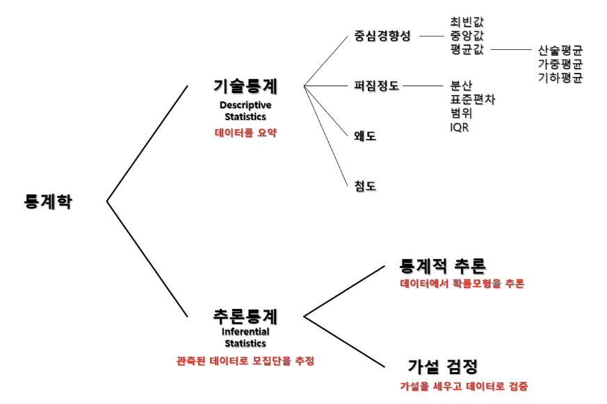
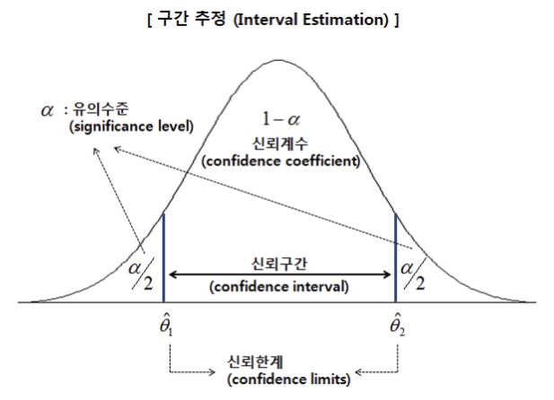
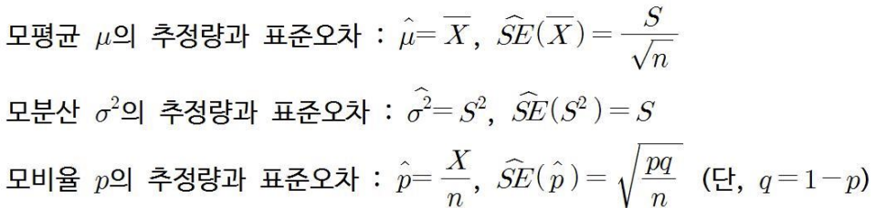
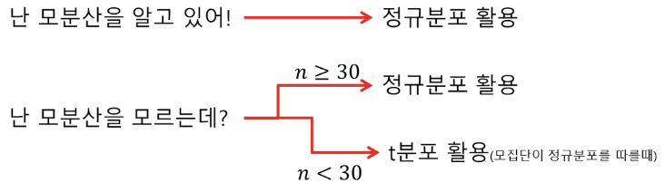
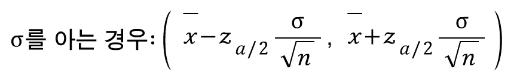
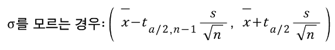
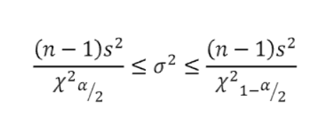
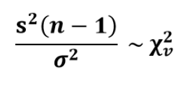
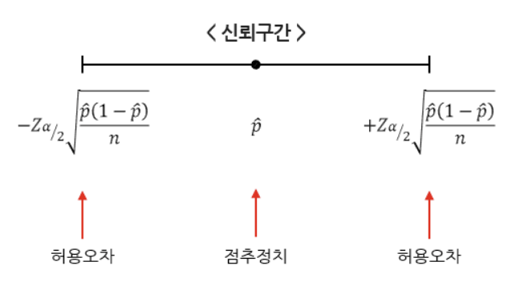
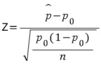

# 통계적 추론과 검정

### 기술통계(모집단)
: 측정이나 실험을 통해 수집한 통계짜료의 정리/표현/요약/해석을 통하여 자료의 특성을 규명하는 방법과 기법
### 추론통계(표본)
: 한 모집단에서 추출한 표본에 대해 그의 모집단의 어떤 특성에 대해 결론을 추론하는 절차와 기법

### ∴ 즉, 통계적 추론과 검정은 '표본데이터에 기초'하여 모집단의 특성에 관한 결론을 얻거나 또는 추론을 하기 위해 사용되는 통계방법

<br>

# 추론통계(Inferential Statistics)
#### 정의
: 표본에 포함된 정보로부터 모집단의 특성을 파악하고, 타당성을 검토하여 모수를 추론하거나 미래를 예측하는 것
#### 활용용도
- 통계적 추정(Statistical Estimation) : 표본의 성격을 나타내는 통계량을 기초로 하여 모수를 추정하는 통계적 분석 방법
- 가설검정(Hypothesis Test) : 모수에 대하여 특정한 가설을 세워놓고, 표본을 선택하여 통계량을 계산한 다음 이를 기초로 하여 모수에 대한 가설의 진위를 판단하는 방법
#### 이론
- 모수(Parameter) : 모집단(Population)의 기술적 척도
- 통계량(Statistic) : 표본(Sample)의 기술적 척도

### ∴ 표본 ≠ 모집단 -> 표본으로 구해지는 결론과 추정치들은 항상 옳은 것이 아님 그래서, 통계적 추론에 신뢰의 척도, 즉 신뢰수준(Confidence Level)과 유의수준(Significance Level) 필요

# 추정(Estimation)
#### 정의
: 모집단에서 추출한 표본에서 얻은 정보를 이용하여 모집단의 평균, 표준편차 등을 추측하는 것
#### 종류
점 추정 : 추정하고자 하는 모수를 표본 데이터를 이용하여 하나의 수치로 추정함<br>
구간추정 : 추정하고자 하는 모수가 존재할 것으로 예상되는 구간을 정하여 추정<br>
&nbsp;&nbsp;&nbsp;※ 모수가 존재할 것으로 예상되는 신뢰수준에 따라 신뢰구간 추정
#### 이론
신뢰수준 : 추정하고자 하는 모평균이 구간(신뢰구간)에 포함될 확률<br>
모평균 신뢰수준 (95%, 99%)<br>


### 추정(Estimation) - 점추정
#### 정의
: 표본 데이터를 이용하여 계산된 **하나의 숫자로 모수의 값을 추측하는 과정**을 말한다.
- 추정 대상 모수 : 모평균, 모표준편차/모분산, 모비율



- 추정량(Estimator) : 일종의 절차
  - 모평균 μ에 대한 점 추정량은 "n개의 표본을 추출하여 얻어지는 값들을 합한 후 n으로 나누라"는 절차
- 추정치(Estimate) : 추정 절차에 따라 실제 추출된 표본값을 대입함으로써 결과적으로 산출된 수치

### 추정(Estimation) - 구간추정
#### 정의
: 모집단에서 추출한 표본에서 얻은 정보를 이용하여 **추정하고자 하는 모수가 존재**하리라 예상되는 **구간을 정함**<br>
: **모수가 존재하리라고 생각되는 신뢰구간과 그 가능성을 나타내는 신뢰수준(신뢰도)이 필요함**
#### 종류
: 모집단의 평균 추정, 모집단의 분산 추정, 모집단의 비율 추정
#### 신뢰구간
: 점 추정값 ± 한계 오차

### 신뢰구간 추정


### 정규정 검정(Normality Test)
: 회귀 분석 등에서는 **확률분포가 정규분포를 따르는지 아닌지를 확인**하는 것이 중요하다. 이러한 검정을 정규성 검정이라고 한다.
#### 정규분포가 아닌 경우 착안사항
- 정규성을 갖지 않는 분포가 반드시 쓸모 없는 것 만은 아니다. 우리는 떄로 비정규성으로부터 이상요인을 파악할 수 있다. 반드시 원인 파악이 필요하다.
- 비정규성을 갖는 데이터는 우리에게 매우 귀중한 정보를 제공하고 있으며, 개선의 방향을 제공해준다.
- 비정규성의 유형과 원인 파악을 할 수 있어야 한다.

### 귀무가설 H0 : 모집단은 정규분포를 따른다.
### 대립가설 H1 : 모집단은 정규분포를 따르지 않는다.

#### 정규성(Normality) 확인
- 통계량에 의한 정규성 검정
  - Shapiro-Wilk normality test : shapiro.test(x)
  - Anderson - Darling test : adTest(x)
- 그래프에 의한 정규성 확인
  - Histogram : hist(x)
  - Kernel density plot : lines(density(x))
  - Q-Q plot : qqnorm(x), qqline(x)

```
[참고자료]

＊Scipy에서 제공하는 정규성 검정 명령어
  - 콜모고로프-스미르노프 검정(Kolmogorov-Smirnov test) : scipy.stats.ks_2samp
  - 샤피로-윌크 검정(Shapiro-Wilk test) : scipy.stats.shapiro
  - 앤더스-달링 검정(Anderson-Darling test) : scipy.stats.anderson
  - 다고스티노 K-제곱 검정(D'Agostino's K-squared test) : scipy.stats.mstats.normaltest

* StatsModels에서 제공하는 정규성 검정 명령어
  - 콜모고로프-스미르노프 검정(Kolmogorov-Smirnov test) : statsmodels.stats.diagnostic.kstest_normal
  - 옴니버스 검정(Omnibus Normality test) : statsmodels.stats.stattools.omni_normtest
  - 자크-베라 검정(Jarque-Bera test) : statsmodels.stats.stattools.jarque_bera
  - 릴리포스 검정(Lilliefors test) : statsmodels.stats.dignostic.lillifors
```

### 모평균(μ) 신뢰구간 추정 - 모표준편차(σ)를 아는 경우
#### 모평균(μ)에 대한 100(1 - α)% 신뢰구간


### 모평균(μ) 신뢰구간 추정 - 모표준편차(σ)를 모르는 경우
#### 모평균(μ)에 대한 100(1 - α)% 신뢰구간
: 반드시 기억해야할 점으로, 모표준편차를 이미 알고 있는 경우는 매우 드물다.<br>
: 일반적인 경우 표본으로부터 표준편차를 추정해야만 한다.<br>
∴ 따라서 미지의 모표준편차 σ 대신 표본표준편차 s를 사용하게 될 경우, 모평균 μ에 대한 100(1 - α)% 신뢰구간은<br>


### 모분산(σ^2) 신뢰구간 추정
#### 모분산(σ^2)에 대한 100(1 - α)% 신뢰구간
: 모집단의 변동을 나타내는 모분산(α^2) 또는 모표준편차(α)를 추정하고자 할 경우가 있음<br>
: 이 때 모집단이 정규분포를 따른다면 모표준편차(α)에 대한 100(1 - α)% 신뢰구간은 아래와 같음<br>


- 카이제곱(χ^2) 분포: 분산(σ^2)이 을 갖는 정규분포를 이루는 모집단으로부터 표본의 크기가 n인 가능한 모든 표본을 뽑을 때, 각 표본의 분산을 s^2 이라고 하면, 다음은 자유도가 Φ = n - 1인 카이제곱 분포를 따름<br>
<br>
즉, 표본분산(s^2)에 (n - 1)을 곱하고 모분산(σ^2)으로 나눈 값은 자유도(v)가 n - 1인 카이제곱(χ^2) 분포를 따른다.

  

### 모비율 신뢰구간 추정
#### 모비율(P)에 대한 100(1 - α)% 신뢰구간
: **모집단의 특성이 비율**(에: 서울지역의 실업률, 복권당첨율 등)에 의해 주어지는 경우 **모비율을 추정**해야 함
: 이항분포의 정규근사화를 가정할 경우, 모비율 P에 대한 100(1 - α)% 신뢰구간은 아래와 같다.<br>

