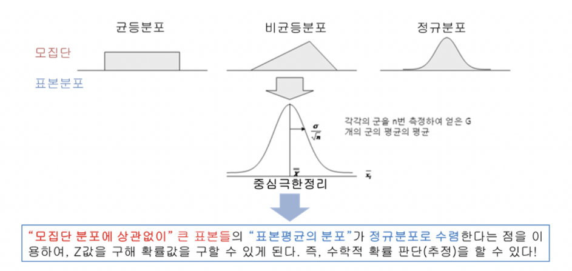

# 표본의 평균의 분포_정규분포
## 중심극한 정리(Central Limit Theorem)
- 평균이 μ이고 분산이 σ^2인 임의의 확률분포를 따르는 모집단으로부터 크기 n인 확률표본 X1, X2, X3, ..., Xn을 취했을 때 이 **확률표본의 표본평균의 분포는 표본의 크기 n이 충분히 클 때** 대략 다음과 같은 정규분포를 따름

- 모집단의 형태가 어떻든지 간에 표본의 평균의 분포는 빠른 속도로 정규분포에 근접하게 됨

### 현실적인 경험 법칙
1. 모집단이 정규분포이면 표본의 평균은 표본 크기에 상관없이 언제나 정규분포이다.
2. 모집단이 적어도 대칭형이면, 표본 크기는 5 ~ 20이면 표본의 평균은 정규분포에 가까워진다.
3. 최악의 경우, 모집단이 정규분포에서 얼마나 벗어났느야에 상관 없이 표본의 평균을 정규분포에 가깝게 하기 위해서는 표본크기가 30이면 충분함