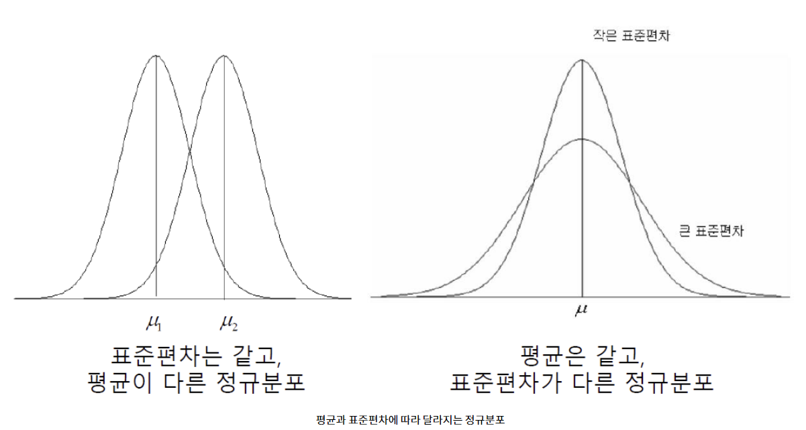

# 확률분포(Probability Distribution)
- 확률변수가 특정 값을 가질 확률, 즉 상대적 가능성을 나타냄
- 모든 가능한 확률변수 값과 그 값이 발생할 확률 값을 도수분포표나 그래프로 나타낸 것

# 확률분포 종류
- 확률변수 데이터 유형에 따른 이산 확률분포와 연속 확률분포

-------------

## 1. 연속 확률분포
### 1-1. 정규분포
### 1-2. 표준정규분포(Z-분포)
### 1-3. t-분포(student t)
### 1-4. 카이제곱(χ^2) 분포
### 1-5. F-분포
### 1-6. 와이블 분포

-------------

## 2. 이산 확률분포
### 2-1. 베르누이 분포
### 2-2. 이항 분포
### 2-3. 포아송 분포
### 2-4. 초기하 분포

-------------

### 1-1. 정규분포
#### 정의
- 평균을 중심으로 좌우 대칭인 "종모양" 분포 [Gauss 분포(Gauss Distribution)라고 함]
- 정규분포는 어떤 실수값이라도 모두 취할 수 있는 연속활률변수 X(-∞ ≤ X ≤ ∞)에 관한 분포로서, x의 평균 μ와 그 표준편차 σ인 두 모수에 의해 그 분포의 특징이 결정됨
- 18세기에 C.F.Gauss(1777-1855)는 측정 기준치와의 차이를 나타내는 측정오차가 어떤 특성을 갖는 분포 형태를 이루고 있음을 알아내었음

- 확률밀도함수


```
- 정규분포의 특징
√ 평균 = μ(분포 위치), 분산 σ^2(분포 모양)
√ 종모양이며 μ를 중심으로 대칭
√ 기호 : X ~ N(μ , σ^2)
```

#### 용도
- 정규분포는 수집된 자료의 분포를 근사하는 데에 자주 사용되며, 이것은 중심극한정리에 의하여 독립적인 확률변수들의 평균은 정규분포에 가까워지는 성질이 있기 때문이다.

#### 분포형태 변화
- 평균과 표준편차의 변화에 따라 정규분포는 다양한 모습으로 나타난다.



#### 히스토그램과 확률분포
- 연속형 Data는 구간의 폭을 작게 하여 분포를 함수 형태로 나타낼 수 있다.


#### 확률 계산
1. 확률 밀도(Probability Density)<br>
  └ X값(점)에서 확률밀도 함수값(f(x))
2. 누적확률(Cumulative Probability)<br>
  └ P(X ≤ x)값
  └ -∞에서 X값(점)까지의 확률밀도의 누적 값 (즉, X를 알때 면적 구하기)
3. 역 누적확률(Inverse Cumulative Probability)<br>
  └ P(X ≤ ?) = Y를 만족하는 X값
  └ 확률값(Y)에 대응하는 X값 (즉, 면적을 알때 X 구하기)

-------------

### 1-2. 표준정규분포
#### 정의
- 정규분포 밀도함수를 통해 X를 Z로 정규화함으로써 평균이 0, 표준편차가 1인 표준정규분포
- 평균이 0이고 표준편차가 1인 정규분포를 표준정규분포(Standard Normal Distribution)라고 한다.

#### 용도
- z-분포로 하는 검정(test)을 z-검정(z-test)이라고 한다.<br>
Z변환
 즉,
<br>

```
- 표준정규분포의 특징
√ 평균 = 0 , 분산 = 1^2
√ 종모양이며 0을 중심으로 대칭
√ 기호 : Z ~ N(0 , 1^2)
```

#### 확률계산
- 정규분포를 표준정규분포로 변환하여 표준정규분포표를 이용하여 확률을 계산

#### Z값 계산
- 표준정규분포는 모든 점수들을 표준점수(Z-Score)로 바꾸어 분포로 표현한 것
- Z 점수들의 평균은 '0'이고 표준편차는 '1'이 됨
```
원점수 분포 μ = 10, σ = 0.2

-> Z변환 (X - μ) / σ

Z점수 분포 μ = 0 , σ = 1

-> 10.392 - 10 / 0.2 = 1.96
```

#### Z-분포에서 표 읽기
- 표준정규분포표에서 새로운 Z-점수의 소수점 1자리, 가로는 소수점 둘째 자리를 나타냄
- Z-점수 1.96 바깥의 면적을 알고 싶으면, 세로에서 1.9를 찾고 가로에서 .06을 찾아 교차되는 지점의 숫자를 참고하면 된다.


-------------

### 1-3. t-분포(student t)
#### 정의
- 정규분포의 평균을 측정할 때 주로 사용
- 표준정규분포와 유사하게 0을 중심으로 좌우대칭
- 표준정규분포 보다 평평하고 기다란 꼬리를 가짐(양쪽 꼬리가 두터운 형태)

#### 용도
- 모집단의 평균 추정, 검정
- 표본의 수가 커짐에 따라 표준정규분포와 모양이 비슷해지므로, 표본의 수가 어느정도 큰 경우(n ≥ 30)에는 표준정규분포를 이용해 확률을 구해도 큰 차이를 보이지 않는다.

<br>
※ df(Degree of Freedom; 자유도)는 표본(데이터)의 개수(n)에서 -1을 한 값이다.

#### 용도 및 특징
- t-분포는 모평균의 추/검정에서 모표준편차를 모들 때 정규분포 대신 사용된다.
- t-분포는 자유도라는 모수에 의해 그 모양이 결정됨<br>
  └ 자유도 혹은 df<br>
  └ 여기서 df = '표본 크기' - 1
- t-분포는 정규분포보다 더 넓고, 꼬리 부분이 더 평평하지만, 대칭형이며, 종모양이라는 점에서 정규분포와 형태가 비슷하다.
- 표본 크기가 더 적으면 적을수록 분포의 꼬리는 더 평평해진다.<br>


### 1-4. 카이제곱(χ^2) 분포
#### 정의