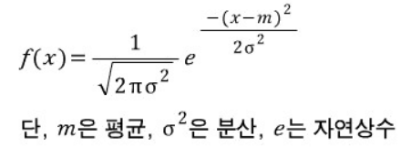
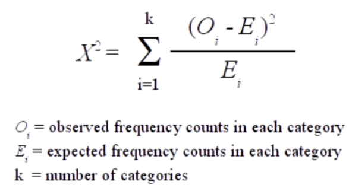

# 확률분포(Probability Distribution)
- 확률변수가 특정 값을 가질 확률, 즉 상대적 가능성을 나타냄
- 모든 가능한 확률변수 값과 그 값이 발생할 확률 값을 도수분포표나 그래프로 나타낸 것

# 확률분포 종류
- 확률변수 데이터 유형에 따른 이산 확률분포와 연속 확률분포

-------------

## 1. 연속 확률분포
### 1-1. 정규분포
### 1-2. 표준정규분포(Z-분포)
### 1-3. t-분포(student t)
### 1-4. 카이제곱(χ^2) 분포
### 1-5. F 분포
### 1-6. 와이블 분포

-------------

## 2. 이산 확률분포
### 2-1. 베르누이 분포
### 2-2. 이항 분포
### 2-3. 포아송 분포
### 2-4. 초기하 분포

-------------

### 1-1. 정규분포
#### 정의
- 평균을 중심으로 좌우 대칭인 "종모양" 분포 [Gauss 분포(Gauss Distribution)라고 함]
- 정규분포는 어떤 실수값이라도 모두 취할 수 있는 연속활률변수 X(-∞ ≤ X ≤ ∞)에 관한 분포로서, x의 평균 μ와 그 표준편차 σ인 두 모수에 의해 그 분포의 특징이 결정됨
- 18세기에 C.F.Gauss(1777-1855)는 측정 기준치와의 차이를 나타내는 측정오차가 어떤 특성을 갖는 분포 형태를 이루고 있음을 알아내었음

- 확률밀도함수


```
- 정규분포의 특징
√ 평균 = μ(분포 위치), 분산 σ^2(분포 모양)
√ 종모양이며 μ를 중심으로 대칭
√ 기호 : X ~ N(μ , σ^2)
```

#### 용도
- 정규분포는 수집된 자료의 분포를 근사하는 데에 자주 사용되며, 이것은 중심극한정리에 의하여 독립적인 확률변수들의 평균은 정규분포에 가까워지는 성질이 있기 때문이다.

#### 분포형태 변화
- 평균과 표준편차의 변화에 따라 정규분포는 다양한 모습으로 나타난다.


#### 히스토그램과 확률분포
- 연속형 Data는 구간의 폭을 작게 하여 분포를 함수 형태로 나타낼 수 있다.


#### 확률 계산
1. 확률 밀도(Probability Density)<br>
  └ X값(점)에서 확률밀도 함수값(f(x))
2. 누적확률(Cumulative Probability)<br>
  └ P(X ≤ x)값
  └ -∞에서 X값(점)까지의 확률밀도의 누적 값 (즉, X를 알때 면적 구하기)
3. 역 누적확률(Inverse Cumulative Probability)<br>
  └ P(X ≤ ?) = Y를 만족하는 X값
  └ 확률값(Y)에 대응하는 X값 (즉, 면적을 알때 X 구하기)

-------------

### 1-2. 표준정규분포
#### 정의
- 정규분포 밀도함수를 통해 X를 Z로 정규화함으로써 평균이 0, 표준편차가 1인 표준정규분포
- 평균이 0이고 표준편차가 1인 정규분포를 표준정규분포(Standard Normal Distribution)라고 한다.

#### 용도
- z-분포로 하는 검정(test)을 z-검정(z-test)이라고 한다.<br>
Z변환
 즉,
<br>

```
- 표준정규분포의 특징
√ 평균 = 0 , 분산 = 1^2
√ 종모양이며 0을 중심으로 대칭
√ 기호 : Z ~ N(0 , 1^2)
```

#### 확률계산
- 정규분포를 표준정규분포로 변환하여 표준정규분포표를 이용하여 확률을 계산

#### Z값 계산
- 표준정규분포는 모든 점수들을 표준점수(Z-Score)로 바꾸어 분포로 표현한 것
- Z 점수들의 평균은 '0'이고 표준편차는 '1'이 됨
```
원점수 분포 μ = 10, σ = 0.2

-> Z변환 (X - μ) / σ

Z점수 분포 μ = 0 , σ = 1

-> 10.392 - 10 / 0.2 = 1.96
```

#### Z-분포에서 표 읽기
- 표준정규분포표에서 새로운 Z-점수의 소수점 1자리, 가로는 소수점 둘째 자리를 나타냄
- Z-점수 1.96 바깥의 면적을 알고 싶으면, 세로에서 1.9를 찾고 가로에서 .06을 찾아 교차되는 지점의 숫자를 참고하면 된다.


-------------

### 1-3. t-분포(student t)
#### 정의
- 정규분포의 평균을 측정할 때 주로 사용
- 표준정규분포와 유사하게 0을 중심으로 좌우대칭
- 표준정규분포 보다 평평하고 기다란 꼬리를 가짐(양쪽 꼬리가 두터운 형태)

#### 용도
- 모집단의 평균 추정, 검정
- 표본의 수가 커짐에 따라 표준정규분포와 모양이 비슷해지므로, 표본의 수가 어느정도 큰 경우(n ≥ 30)에는 표준정규분포를 이용해 확률을 구해도 큰 차이를 보이지 않는다.

<br>
※ df(Degree of Freedom; 자유도)는 표본(데이터)의 개수(n)에서 -1을 한 값이다.

#### 용도 및 특징
- t-분포는 모평균의 추/검정에서 모표준편차를 모들 때 정규분포 대신 사용된다.
- t-분포는 자유도라는 모수에 의해 그 모양이 결정됨<br>
  └ 자유도 혹은 df<br>
  └ 여기서 df = '표본 크기' - 1
- t-분포는 정규분포보다 더 넓고, 꼬리 부분이 더 평평하지만, 대칭형이며, 종모양이라는 점에서 정규분포와 형태가 비슷하다.
- 표본 크기가 더 적으면 적을수록 분포의 꼬리는 더 평평해진다.<br>


### 1-4. 카이제곱(χ^2) 분포
#### 정의
- 정규분포를 따르는 모집단에서 크기가 n인 표본을 무작위로 반복하여 추출하였을 때, 각 표본에 대해 구한 표본분산들은 카이제곱 분포를 따름

#### 용도
- 모집단의 분산 추정
- 빈도 기반의 분포 또는 형태 적합도 검정
- 여러 집단 간의 독립성/동질성 검정<br>
<br>


### 1-5. F 분포
#### 정의
- 분산이 같은 두 정규모집단으로부터 크기 n1과 크기 n2의 확률표본을 독립적으로 추출한 후, 구한 두 표본분산의 비율들의 표본분포

#### 용도
- F 분포는 두 분포의 분산을 비교하는데 흔히 활용
- ANOVA에서는 그룹 내 변동과 그룹간 변동으로 여러 개의 평균값을 비교하는데 활용
- 회귀분석에서 t-분포는 개별 회귀계수의 유의성을 검정하는데 쓰이고, 회귀모형 자체의 유의성 검정<br>
<br>
<br>

#### 특징
- F 분포는 카이제곱(χ^2) 분포와 마찬가지로, 종형의 대칭 분포가 아니다.
- 표준정규분포를 제곱하여 합한 카이제곱(χ^2) 분포 2개를 서로 나눈 값이므로, 0보다 큰 영역에서만 그려진다.
- F(n1, n2)와 1 / F(n2, n1)은 동일한 분포를 가진다.
- t-분포를 제곱하면 F 분포를 하게 된다.

### 1-6. 와이블(Weibull) 분포
#### 정의
- 지수분포를 보다 일반하 시켜, 여러 다양한 확률분포 형태를 모두 나타낼 수 있도록 고안되었다.
  - 특히, 신뢰성 분야의 응용에서 자주 사용되는 수명 분포
- 부품의 고장까지의 시간 혹은 수명 등과 같이 신뢰성과 수명시험 문제에 적용되는 분포
  - 실패시간, 대기시간 등
- 스웨덴 물리학자 W.Weibull가 재료의 파괴강도를 설명하기 위해 1939년에 제안했다.<br>
<br>


#### 활용
- 설비 또는 부품의 수명 추정 분석
- 신뢰성 공학에서 실패 분석

#### 특징
- 척도모수(Scale parameter)와 형상모수(Shape parameter)에 따라 분포의 모양이 변한다.
  - 특히, 형상모수가 1인 경우 지수 분포(Exponential distribution)
  - 형상모수가 2인 경우 라이레히 분포(Rayleigh distribution)

### 2-2. 이항분포(Binomial distribution)
#### 베르누이 실행
- 표본공간이 단지 두 개의 상호배타적인 원소로 구성된 실험의 시행을 말하며, 매번 실행마다 이 두 개의 원소 중에서 하나만이 실험의 결과로서 나타남

#### 베르누이 변수의 정의
- 확률변수 X가 단지 두 개의 값 중에 하나를 취할 때, 즉 Sx = {0, 1} 이고 P(X=1) = p 일 때, 변수 X는 모수가 p인 베르누이 분포를 따른다고 함

#### 이항분포 정의
- 이항분포는 베르누이 실험을 여러 번 시행해서 특정한 횟수의 성공/실패 또는 양품/불량품이 나타날 확률을 알고자 할 때, 사용되는 분포로 베르누이 분포는 이항분포에서 시행횟수 n = 1인 특수한 경우이다.
  - 베르누이 시행을 n반 시행함 (예: 동전을 n번 던짐)
  - 각 시행마다 성공(예: 동전의 앞면)의 확률 p는 항상 일정함
  - 각 시행은 통계적으로 독립적임

  

#### n과 p의 값에 따른 이항분포 그래프 유형
- 일반적으로 P -> 0.5 이고 n => ∞ 일 때, 이항분포는 정규분포 곡선에 가까워진다.(이항분포의 정규 근사)<br>


### 2-3. 포아송 분포(Poisson distribution)
#### 정의
- 일정한 시간 또는 일정한 공간에서 발생하는 성공 횟수에 대한 이산확률분포
  - 예) 1시간 동안 서비스 창구에 도착하는 자동차의 수

#### 활용
- 일정 시간/공간에서의 사건 발생 확률 예측
  - 1킬로미터 도로에 있는 흠집의 수
  - 은행의 창구에 시간당 도착하는 고객의 수가 x명 이하일 확률
  - 자동차 대리점에서 하루에 차가 x대 이상 팔릴 확률

  
  